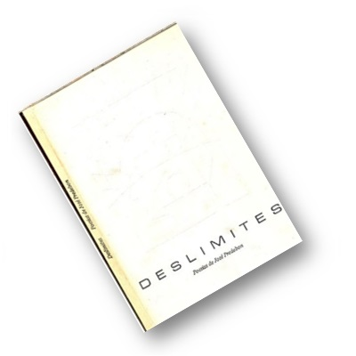

  

    
  

  

    <h2>DESLIMITES</h2>
    
Livro de Poesias de José Predebon

    | Poesia 1 | Poesia 2 |
    |----------|----------|
    | [DESLIMITES](/criatividade/livros/deslimites/poesias/deslimites/) | [O QUE VALE O VOAR](/criatividade/livros/deslimites/poesias/o-que-vale-o-voar/) e [DESCONFIO DA LÓGICA](/criatividade/livros/deslimites/poesias/desconfio-da-logica/) |
    | [SÓ VIVER](/criatividade/livros/deslimites/poesias/so-viver/) | [NADA SE DEVE](/criatividade/livros/deslimites/poesias/nada-se-deve/) |
    | [SONHO](/criatividade/livros/deslimites/poesias/sonho/) | [AJUSTE](/criatividade/livros/deslimites/poesias/ajuste/) e [DESENCANTO](/criatividade/livros/deslimites/poesias/desencanto/) |
    | [DIÁLOGO](/criatividade/livros/deslimites/poesias/dialogo/) e [TOMA LÁ](/criatividade/livros/deslimites/poesias/toma-la/) | [REFLEXÃO](/criatividade/livros/deslimites/poesias/reflexao/) |
    | [DO AMBICIOSO](/criatividade/livros/deslimites/poesias/do-ambicioso/) | [SEJA ASSIM](/criatividade/livros/deslimites/poesias/seja-assim/) e [PESADELO](/criatividade/livros/deslimites/poesias/pesadelo/) |
    | [AO QUE VAI](/criatividade/livros/deslimites/poesias/ao-que-vai/) | [AMIZADE](/criatividade/livros/deslimites/poesias/amizade/) e [SOLIDARIEDADE](/criatividade/livros/deslimites/poesias/solidariedade/) |
    | [RITOS](/criatividade/livros/deslimites/poesias/ritos/) e [DAR-SE](/criatividade/livros/deslimites/poesias/dar-se/) | [LEMBRAS](/criatividade/livros/deslimites/poesias/lembras/) e [SÓ E BEM](/criatividade/livros/deslimites/poesias/so-e-bem/) |
    | [ENLEVO](/criatividade/livros/deslimites/poesias/enlevo/) | [LEMBRANÇAS](/criatividade/livros/deslimites/poesias/lembrancas/) |
    | [EXPECTATIVA](/criatividade/livros/deslimites/poesias/expectativa/) | [SER ESPECIAL](/criatividade/livros/deslimites/poesias/ser-especial/) |
    | [DO PAI](/criatividade/livros/deslimites/poesias/do-pai/) | [DO VELHO NO ESPELHO](/criatividade/livros/deslimites/poesias/do-velho-no-espelho/) e [AUTENTICIDADE](/criatividade/livros/deslimites/poesias/autenticidade/) |
    | [A ARTE DO POSSIVEL](/criatividade/livros/deslimites/poesias/a-arte-do-possivel/) e [CONCILIAR](/criatividade/livros/deslimites/poesias/conciliar/) | [MUDAR](/criatividade/livros/deslimites/poesias/mudar/) |
    | [PLANO DE DEFESA](/criatividade/livros/deslimites/poesias/plano-de-defesa/) e [ANDAR É PRECISO](/criatividade/livros/deslimites/poesias/andar-e-preciso/) | [SIM E NÃO](/criatividade/livros/deslimites/poesias/sim-e-nao/) e [GREGÁRIOS?](/criatividade/livros/deslimites/poesias/gregarios/) |
    | [POR QUEM OS JOVENS VOAM](/criatividade/livros/deslimites/poesias/por-quem-os-jovens-voam/) | [FILHOS](/criatividade/livros/deslimites/poesias/filhos/) |
    | [SER NATURAL](/criatividade/livros/deslimites/poesias/ser-natural/) | [NATAL](/criatividade/livros/deslimites/poesias/natal/) |
    | [ANO NOVO](/criatividade/livros/deslimites/poesias/ano-novo/) e [ATÉ SEMPRE](/criatividade/livros/deslimites/poesias/ate-sempre/) |  |

    
"É PRECISO PARTIR JÁ, HÁ MUITAS VERDADES A VISITAR".

    
(*) clique nos títulos para ler

  

